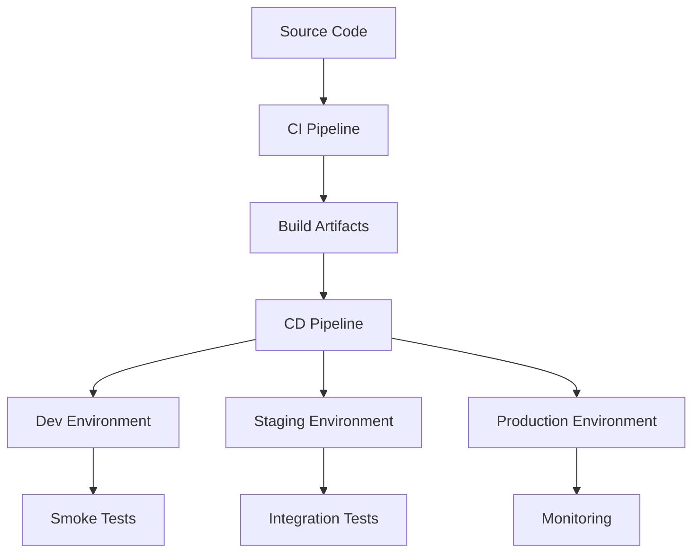

# Azure AutoDeploy WebMaster - Pipeline Architecture

## System Overview

## Pipeline Components

1. **CI Pipeline**:
   - Code checkout
   - Dependency installation
   - Build process
   - Unit testing
   - Artifact generation

2. **CD Pipeline**:
   - Environment-specific deployment
   - Slot swapping (blue-green deployment)
   - Health checks
   - Rollback mechanism

3. **Monitoring**:
   - Application Insights integration
   - Deployment status tracking
   - Alerting system

## Deployment Strategies

| Strategy | Description | When to Use |
|----------|-------------|-------------|
| Rolling | Gradual instance replacement | Low-risk updates |
| Blue-Green | Complete environment swap | Zero-downtime deployments |
| Canary | Gradual traffic shift | Testing with production traffic |

## Security Considerations
- All secrets stored in Azure Key Vault
- Pipeline uses service principal with least privileges
- Network isolation between environments
- Regular dependency vulnerability scanning